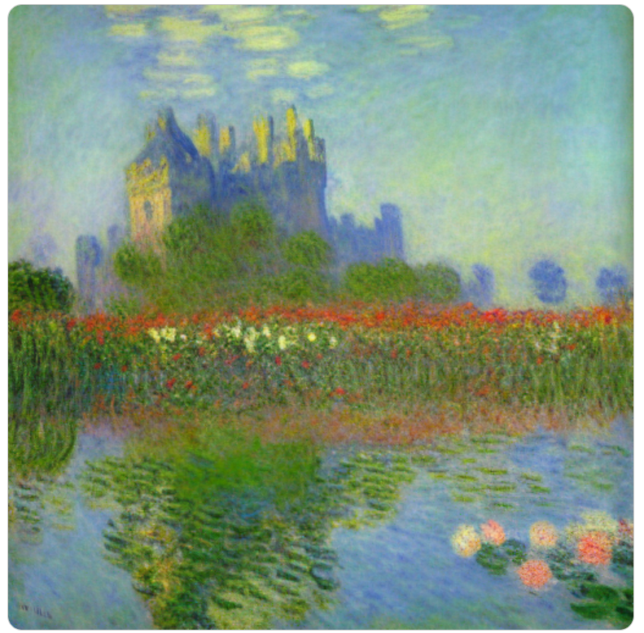

# AI创意图像工坊项目（AI Image Lab）
## 1. 项目概述
本项目是一个前后端分离的图像风格迁移与创意图像生成平台，支持用户上传图片并选择不同风格进行艺术转换。项目支持两种模式：

* **快速风格迁移**：使用预训练模型即时生成图像（Fast Neural Style Transfer）
* **个性化定制风格迁移**：上传内容图和风格图，自定义生成艺术作品（VGG 迁移优化）
### 项目结构

```bash
ai-image-lab/
├── frontend/          # React + Tailwind 前端界面
├── backend/           # Flask 后端服务器与风格迁移逻辑
├── .venv/             # Python 虚拟环境（推荐使用）
└── README.md          # 项目说明文件
```

## 2. 环境配置 + 执行方式
### 2.1 克隆并进入项目
```bash
git clone https://github.com/your-username/ai-image-lab.git
cd ai-image-lab
```
### 2.2 配置 Python 虚拟环境 + 安装依赖
```bash
python3 -m venv .venv           
source .venv/bin/activate      
cd backend
pip install -r requirements.txt 
```
```bash
pip install flask torch torchvision pillow pyyaml tqdm
```
### 2.3 启动后端 Flask 服务
```bash
cd backend
python app.py
```

## 🖼️ 功能模块说明

| 功能模块             | 说明                                         |
| ---------------- | ------------------------------------------ |
| 快速风格迁移（FastNST）  | 用户上传内容图，选择内置风格（如 Candy、Mosaic）快速生成艺术图像     |
| 个性化风格迁移（VGG NST） | 用户上传内容图与风格图，通过后端运行优化算法生成独特作品               |
| 动漫风、抽象风支持        | 支持训练自定义风格，未来可扩展 AnimeGAN、Colorization 等子模块 |

---

## 📌 注意事项

* 项目默认使用 GPU 加速（支持 CUDA），也可在 CPU 上运行（速度较慢）
* 前端构建使用 Vite + TailwindCSS，需 Node.js 环境
* 后端默认使用 PyTorch、Flask，需 Python 3.8+

## 数据集
wikiart风格图片数据集


## 模型方法
### 文生图： Stable Diffusion v1.5
使用 Stable Diffusion v1.5作为文本生成图像的模型，Stable Diffusion 是一种 Latent Diffusion Model（LDM），即在图像的潜空间中进行扩散建模的生成模型。它主要由以下三个部分组成：

文本编码器（CLIP Text Encoder）：
使用 OpenAI 提供的 CLIP（ViT-L/14）模型将输入的文本 prompt 转换为嵌入向量。
这些向量作为条件输入，指导图像的生成过程。

潜空间扩散模型（U-Net）：
对压缩后的图像表示进行多步去噪训练（reverse diffusion）。
使用 DDPM（Denoising Diffusion Probabilistic Models）方法逐步还原原始图像。

图像解码器（VAE Decoder）：
把 U-Net 预测的潜空间图像映射回 RGB 图像，实现最终图像输出。

###  LoRA 微调 Stable Diffusion
LoRA（Low-Rank Adaptation）是一种 轻量级模型微调技术，只对部分模块（比如 Transformer 的 attention 或 UNet 中的卷积）引入了两层可训练的低秩矩阵：

训练时只更新这些小矩阵

推理时合成原始权重 + LoRA 参数的组合

优点：

内存占用极小

训练非常快（本地几分钟就能训练完一个风格）

可以模块化加载（不同风格分别保存为 safetensors 权重）
训练定制的风格
速度快？


### 图像风格迁移：


## ai创意图像生成平台
### 文生图模块
#### 1.功能概述
本模块支持用户输入文本提示，并选择指定风格（如 Monet、Van Gogh），由后端加载对应的事先训练好的 LoRA 微调模型，使用 Stable Diffusion 生成风格化图像。最终图像实时展示于前端页面。

#### 2.

## 运行效果
prompt:a castle in the air
monet风格：印象派、柔和的色彩、模糊的边界、光影变化、风景、花园、睡莲、日出等自然场景

van-gogh风格：后印象派、强烈的笔触、鲜艳的色彩对比、激烈的情感表达、螺旋/波纹状的线条结构


