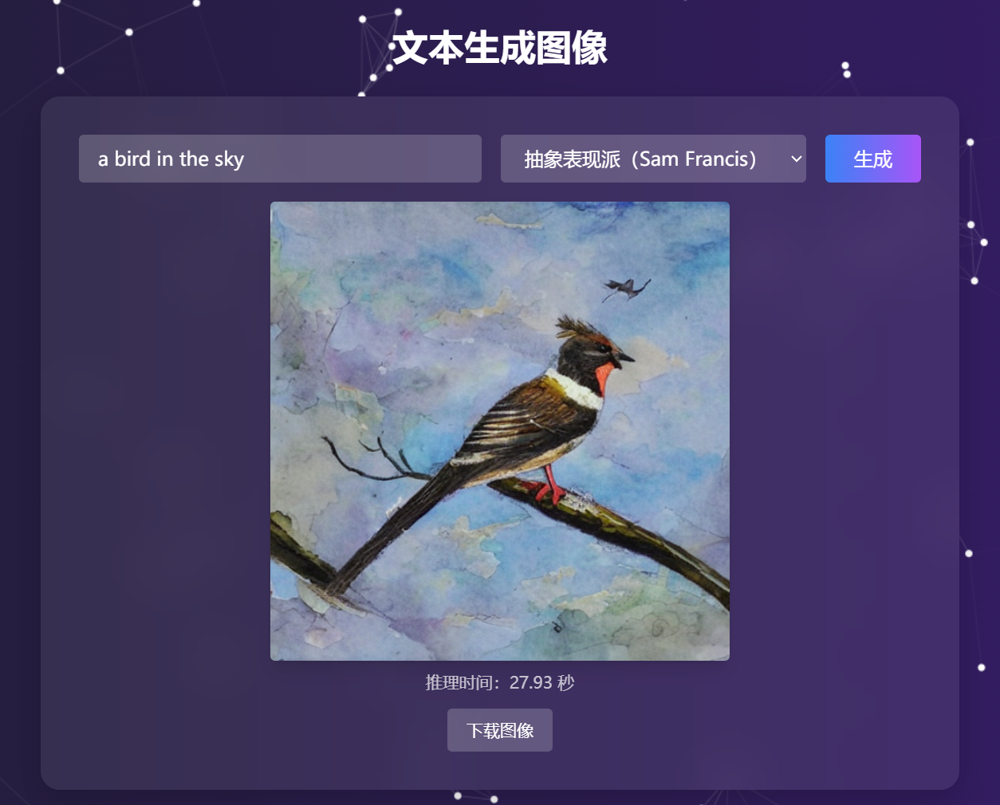
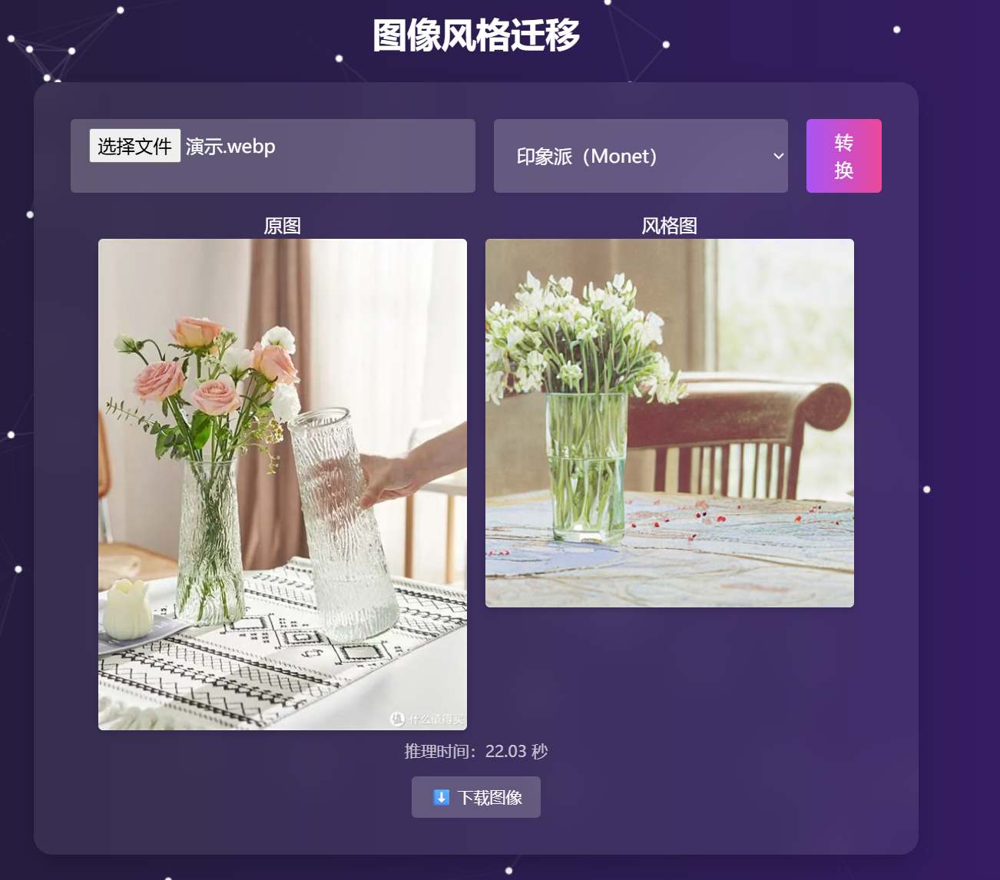

# AI创意图像工坊项目
## 一、项目概述
本项目"ai-image-lab"是一个基于 Stable Diffusion 模型的图像创意生成平台，集成了文本生成图像与图像风格迁移两大功能，支持用户自定义描述文字或者内容图，并可以选择风格模型，快速生成艺术图像，满足创意生成与审美改造的需求。

## 二、项目结构
```
ai-image-lab/
├── frontend/                # 前端界面
├── backend/                 # Flask 后端服务
│   ├── app.py               # 主接口逻辑
│   └── static/              # 图像输出目录
├── models/
│   ├── stable-diffusion-v1-5/   # 预下载基础模型
│   └── lora/                   # 经过微调的各种风格的 LoRA 模型
├── requirements.txt
└── README.md
```

## 三、实验环境与运行方式
### 3.1 AI创意图像工坊平台环境
#### 克隆并进入项目
```bash
git clone https://github.com/your-username/ai-image-lab.git
cd ai-image-lab
```
#### 配置 Python 虚拟环境 + 安装依赖
```bash
python3 -m venv .venv           
source .venv/bin/activate      
cd backend
pip install -r requirements.txt 
```
```bash
pip install flask torch torchvision pillow pyyaml tqdm
```
#### 启动后端 Flask 服务
```bash
cd backend
python app.py
```
浏览器访问：[http://localhost:5000/](http://localhost:5000/)

### 3.2 训练模型环境


## 四、模型说明
### 4.1 文生图（Stable Diffusion v1.5）
* 文本提示词由 CLIP 编码器处理为语义向量
* 潜空间去噪由 UNet 完成，使用 DDIM 多步迭代
* VAE 解码生成最终图像

### LoRA 微调（风格建模）

* LoRA（Low-Rank Adaptation）冻结原模型，仅训练 attention 子层的 rank-适配矩阵
* 每种风格微调仅需约 2–5 分钟，显存占用小，可热加载 `.safetensors` 权重文件
* 示例微调命令如下：

```bash
accelerate launch train_lora.py \
  --pretrained_model_name_or_path /your/path/stable-diffusion-v1-5 \
  --instance_data_dir /your/path/my_style_images \
  --output_dir /your/path/lora/monet \
  --instance_prompt "<monet-style>" \
  --resolution 512 --train_batch_size 1 \
  --max_train_steps 200 --mixed_precision fp16
```

### 图像风格迁移（图生图）

* 使用 `StableDiffusionImg2ImgPipeline` 处理上传图像
* 结合 style prompt 生成风格融合图像
* 支持 strength 控制迁移强度，保留图像结构

## 五、运行效果
文生图（stable-diffusion-v1-5只支持英文提示词）
{: width="400px" }

图像风格迁移
{: width="400px" }

## 六. 项目资料
完整报告链接：待完成

AI图像生成项目地址：https://github.com/ddsfda99/ai-image

微调训练+模型比较分析项目地址：https://github.com/ddsfda99/fine_tuning/tree/main

